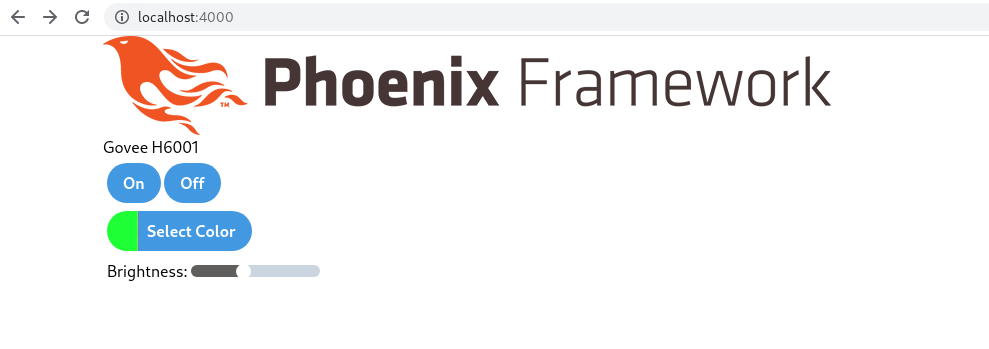

TODO:
- [ ] create interface over scenic conn and govee device
  - Currently I'm working around this by relying on the name
  - Maybe Govee get_conns should return a Conn (translated from a device?)
  - i.e. Conn can be the translation layer so that govee_phx doesn't need to know about a raw device
- [ ] Clean up "GoveePhx.ScenicThing"
- [ ] General code cleanup
- [x] See where a driver is being started
  - And then pass the default scene another way so we can listen to the correct topic for each scenic conn
- [x] Get multiple govee scenic windows to work at the same time
- [ ] Provide a cleaner way to get a named govee scenic conn
  - Probably involves passing in an identifier in instead of loading from config at init time
- [ ] Track and display connection status per device
  - How should this be communicated? Phoenix PubSub?
- [ ] Should govee scenic pubsub be configurable? Right now it's hard-coded
- [x] Remove raw GenServer.call's
- [x] Sync brightness?
- [ ] Need to handle either adding dynamic or static devices (i.e. for BLE devices they will probably be mostly configured)
- [x] Test with an actual device

# GoveePhx

A simple Phoenix LiveView interface to a Govee H6001 LED bulb. Built with
[BlueHeron](https://github.com/smartrent/blue_heron/). The code to actually
control the govee H6001 can be found at https://github.com/axelson/govee

## Running

Pre-req: after first compiling, run `./contrib/fix-perms.sh`

To start your Phoenix server:

  * Install dependencies with `mix deps.get`
  * Install Node.js dependencies with `npm install --prefix assets`
  * Start Phoenix endpoint with `mix phx.server`

Now you can visit [`localhost:4000`](http://localhost:4000) from your browser.

## Updating

Run `mix assets.deploy` before pushing to git

This is important because this is how the top-level application pulls the latest assets (especially js)
